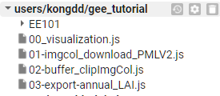

# gee_tutorial

> Dongdong Kong

Open your browser, and add this repository to `Reader`:
https://code.earthengine.google.com/?accept_repo=users/kongdd/gee_tutorial

## Note

> This repository is under the license of MIT.
